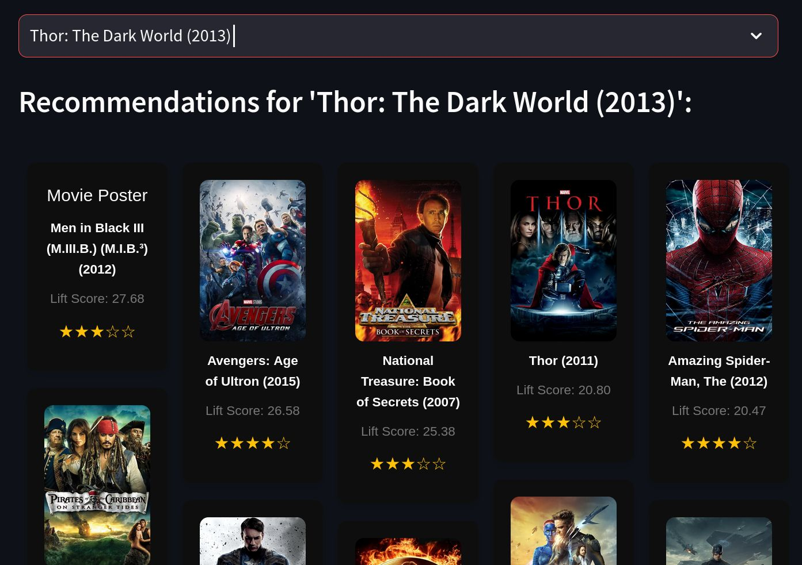

## miniProjetML — MovieLens Association Rules & Streamlit demo

This repository contains a small project that explores association rule mining (Apriori / FP-Growth) over the MovieLens `ml-latest-small` dataset and provides a small Streamlit app and notebook to explore results.

### Highlights

- Preprocessing and frequent-pattern mining implemented in `train.ipynb` (uses `mlxtend`).
- A Streamlit demo app is available in the `StreamLit/` folder for interactive exploration.
- Reports are attached as PDFs (`report.pdf`, `MLFlow-report.pdf`).

## Screenshot

Below is a screenshot of the Streamlit app:



## Repository structure

- `train.ipynb` — Jupyter notebook that: loads MovieLens, filters ratings (>= 3.5), groups user favorite titles, encodes transactions and computes frequent itemsets with `mlxtend`'s `fpgrowth`/`apriori`, and generates association rules.
- `analyze_mlflow_runs.py` — script to analyze MLflow runs (if you use MLflow for experiments).
- `StreamLit/` — Streamlit app and supporting files:
  - `StreamLit/app.py` — Streamlit application entrypoint.
  - `StreamLit/requirements.txt` — Python dependencies for the Streamlit app.
  - `StreamLit/ml-latest-small/` — local copy of the MovieLens small dataset used by the notebook/app (contains `movies.csv`, `ratings.csv`, `tags.csv`, `links.csv`, `README.txt`).
- `report.pdf`, `MLFlow-report.pdf` — project reports and analysis exported as PDF.

## Dataset

This project uses the MovieLens `ml-latest-small` dataset placed under `StreamLit/ml-latest-small/`. Key files used:

- `movies.csv` — movie metadata (movieId, title, genres).
- `ratings.csv` — user ratings. The notebook filters for `rating >= 3.5` to select positive interactions.
- `tags.csv`, `links.csv` — auxiliary files available in the dataset.

If you don't have these files locally, you can download the MovieLens dataset from https://grouplens.org/datasets/movielens/ and place it at `StreamLit/ml-latest-small/`.

## Quick setup

Recommended: create and use a virtual environment. From the repository root (Linux / bash):

```bash
# create venv (python3 must be available)
python3 -m venv .venv
source .venv/bin/activate

# install requirements for the Streamlit app
pip install -r StreamLit/requirements.txt

# Optional: install dependencies needed by the notebook (mlxtend, seaborn, pandas, matplotlib)
pip install mlxtend seaborn pandas matplotlib jupyterlab
```

Note: `StreamLit/requirements.txt` is the canonical list to run the Streamlit app. The notebook uses `mlxtend` for TransactionEncoder, `fpgrowth`/`apriori` and `association_rules`.

## Run the Streamlit app

From the repository root with the virtualenv activated:

```bash
streamlit run StreamLit/app.py
```

This will start the app (default port 8501). Open the URL printed in the terminal (usually http://localhost:8501).

## Open the Jupyter notebook

Start Jupyter (or JupyterLab) and open `train.ipynb`:

```bash
jupyter lab
# then open train.ipynb in the browser
```

The notebook contains the end-to-end process used in this project, including:

- Reading CSVs from `StreamLit/ml-latest-small/` (ensure the relative paths are correct).
- Filtering ratings (`rating >= 3.5`) to create positive interactions.
- Grouping movies per user into transaction lists.
- Encoding transactions with `mlxtend.preprocessing.TransactionEncoder` and computing frequent itemsets with `apriori` and `fpgrowth`.
- Generating association rules using `mlxtend.frequent_patterns.association_rules` (e.g., metric="lift").

## Reproducing main steps (notebook summary)

Key parameters used in the notebook:

- Ratings filtered: `rating >= 3.5` (to keep positive interactions)
- Transaction encoder -> boolean DataFrame
- Frequent itemsets: `min_support=0.01`, `max_len=2` (experiment with these)
- Association rules: metric `lift` and threshold tuned in the notebook

Adjust `min_support` and `max_len` if you want more/less patterns.

## Reports and analysis

- `report.pdf` — project report (contains method, dataset visualization, and association rule results).
- `MLFlow-report.pdf` — MLflow experiment report (if experiments were tracked with MLflow).

## Troubleshooting

- If the Streamlit app can't find the dataset, confirm the `StreamLit/ml-latest-small/` path exists and contains `movies.csv` and `ratings.csv`.
- If notebook cells error about imports, ensure the virtual environment is active and required packages are installed (`mlxtend`, `pandas`, `seaborn`, `matplotlib`).

## Next steps / suggestions

- Add a minimal `LICENSE` file (e.g., MIT) if you plan to share the repository.
- Add a small test or CI to verify the app starts and the notebook runs some minimal checks.
- Convert the notebook to a scripted `.py` pipeline for reproducible runs.

## Author

Ahmed SAADI  
Sidi Bel’abbes • saadi.ahmed.eng@gmail.com • 0541533015

Education
Higher School of Computer Science 08-MAI-1945 (ESI-SBA)  
Sidi Bel Abbès, Algeria
Engineering Degree and M2 – Specialization: Artificial Intelligence & Data Science  
Expected Graduation: 2026

Relevant Coursework: Computer Vision, Machine Learning, Deep Learning, Natural Language Processing, Data Science

---
Generated: README to help onboard and run the project. If you'd like, I can also add a `LICENSE` and a short `CONTRIBUTING.md`.
